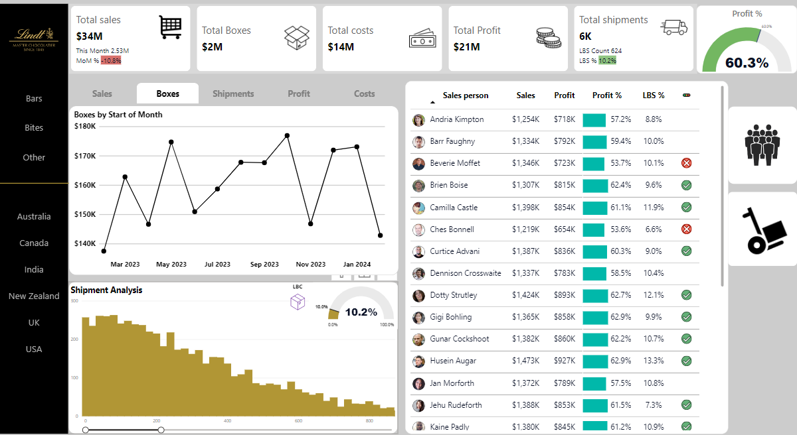

**# Power BI Sales Dashboard**

This repository contains a Power BI dashboard designed to visualize and analyze sales data. The dashboard provides insights into various sales metrics, helping users understand sales performance, trends, and patterns.

See the Full Dash Board Here - [App PowerBI Link](https://app.powerbi.com/view?r=eyJrIjoiNzVkNzUwMWMtNGM4Yy00YTQ2LTg5ZDEtMmYyOTA4NmQ3YWQ2IiwidCI6IjE3ZjFhODdlLTJhMjUtNGVhYS1iOWRmLTlkNDM5MDM0YjA4MCIsImMiOjF9)

  
 
**Features**

**Sales Overview**: A comprehensive view of total sales, total boxes sold, total costs, and total profit. It also includes the month-over-month (MoM) growth percentage.  
**Product Performance**: Detailed analysis of sales, profit, and profit percentage by product. The dashboard highlights the top-performing products and provides a visual representation of profit margins.  
**Boxes Analysis**: A line chart showing the number of boxes sold by the start of each month, helping to identify trends over time.  
**Shipment Analysis**: A histogram and percentage gauge showing shipment details, including the LBS (pounds) percentage and Low Box Count (LBC) percentage.  
**Salesperson Performance**: Analysis of sales, profit, profit percentage, and LBS percentage by salesperson.  
**Geographic Breakdown**: Sales data segmented by different regions, including Australia, Canada, India, New Zealand, UK, and USA.  
**Interactive Elements**: The dashboard includes interactive elements such as tabs for different categories (Bars, Bites, Other) and visual indicators (e.g., checkmarks and crosses) for easy interpretation of product performance.  

**Explanation of Metrics**

**Total Sales**: The total revenue generated from sales.  
**Total Boxes**: The total number of boxes sold.  
**Total Shipments**: The total number of shipments, easily figured out from the shipment table.  
**Total Costs**: Calculated from the product table by taking the cost per box.  
**Total Profit**: The difference between total sales and total costs.  
**Profit Percentage**: The percentage of profit relative to sales.  
**Low Box Count (LBC)**: A metric indicating the number of low box counts.  
**Low Box Percentage (LBC%)**: The percentage of low box counts relative to total boxes.  
**Month on Month (MoM)**: Growth percentage comparing the current month to the previous month.  
**Year on Year (YoY)**: Growth percentage comparing the current year to the previous year.  

**Files**

**Sales_Dashboard.pbix**: The main Power BI dashboard file.  
**Data Sources**: Folder containing sample data sources used in the dashboard (ac-sample-data.xlsx).  
**README.md**: This file, providing an overview of the repository and instructions for use.  

**How to Use**

Download the .pbix file: Clone the repository or download the Sales_Dashboard.pbix file directly.  
Open in Power BI Desktop: Open the .pbix file using Power BI Desktop.  
Refresh Data: Connect your data sources and refresh the data to see the latest insights.  
Explore the Dashboard: Use the interactive visuals to explore and analyze the sales data.  

Getting Started  
To get started with the Power BI dashboard, follow these steps:  

**Clone the Repository:**  

Open Power BI Desktop and load  (ChocolateSalesDataFile)() file.  
**Connect Your Data Source**s: Update the data source connections to match your data environment.  
**Refresh Data**: Refresh the data in Power BI to load the latest data.  
**Publish to Power BI Service**: Optionally, publish the dashboard to the Power BI Service for online access and sharing.  

**Access the Dashboard Online**  
You can view the dashboard online via this Power BI link.  

**Contributing**  
Feel free to fork this repository, make enhancements, and submit pull requests. Your contributions are welcome!  

**License**  
This project is licensed under the MIT License - see the LICENSE file for details.  
