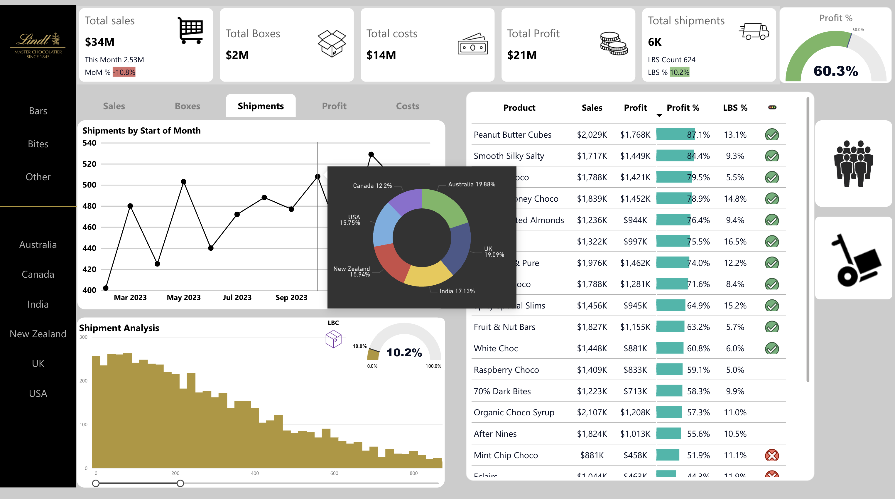
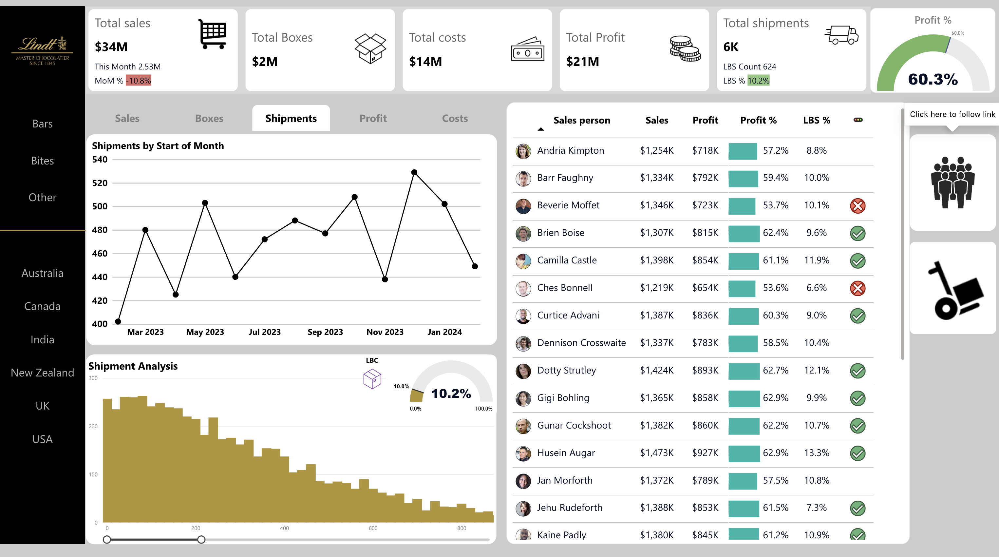
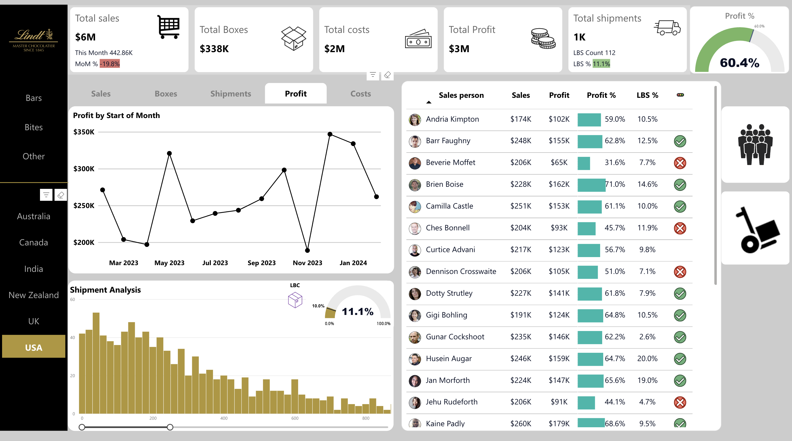
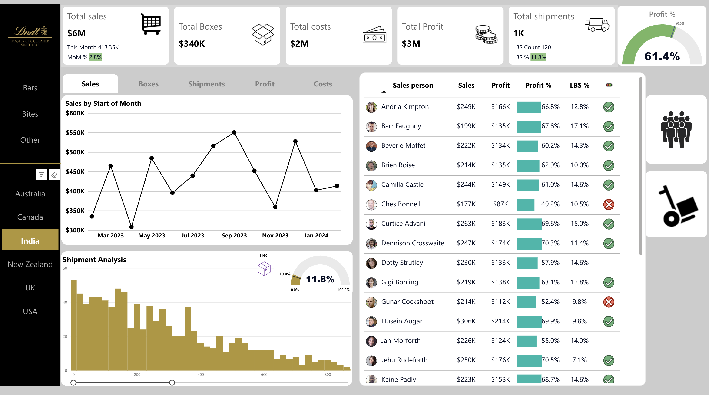

# 📊 Lindt Chocolate Power BI Dashboard

🚀 **Overview**
This repository contains an interactive **Power BI Sales Dashboard** for **Lindt Chocolate**, designed to track **sales performance, product profitability, and shipment trends**. This dashboard provides real-time insights, helping businesses optimize their **sales, logistics, and regional strategies**.

🔗 **View the Full Dashboard Here:**  
[Lindt Chocolate Power BI Dashboard](https://app.powerbi.com/view?r=eyJrIjoiNzVkNzUwMWMtNGM4Yy00YTQ2LTg5ZDEtMmYyOTA4NmQ3YWQ2IiwidCI6IjE3ZjFhODdlLTJhMjUtNGVhYS1iOWRmLTlkNDM5MDM0YjA4MCIsImMiOjF9)

📸 **Dashboard Previews:**

-   *(1 - Main Page: Sales Performance Overview)*
-  *(Tooltip - Region Analysis Tooltip Feature)*
-  *(Product - Product Performance Breakdown)*
-  *(People - Sales Team Performance)*
-  *(USA - Regional Sales Breakdown)*
-  *(India - Regional Sales Breakdown)*

---

## **🔍 Key Insights from the Dashboard**

### **📸 1 - Main Page: Sales Performance Overview**
- **Total Sales & Costs**: Tracks revenue and expenditure for performance analysis.
- **MoM (Month-over-Month) Growth**: Shows whether sales are **increasing or decreasing** compared to the previous month.
- **Total Profit & Profit Margins**: Helps evaluate financial efficiency.
- **Shipment Metrics (LBC % - Low Box Count)**: Analyzes shipment sizes and logistics efficiency.

### **📸 Tooltip - Tooltip Feature Explanation**
- **Dynamic Tooltip Analysis**: Displays additional insights when hovering over regions.
- **Region Distribution Chart**: Presents **sales share per country**, helping in regional comparison.

### **📸 Product - Product Performance Breakdown**
- **Top-Selling Products**: Highest revenue generators include **Peanut Butter Cubes, Smooth Silky Salty, and Manuka Honey Choco**.
- **Profitability per Product**: Some products yield **high revenue but low margins**, while others maintain **high-profit margins** with fewer sales.
- **Category Segmentation**: Divides products into **Bars, Bites, and Other**, making it easy to analyze category-wise performance.

### **📸 People - Sales Team Performance**
- **Top Sales Representatives**: Displays best-performing salespeople based on **sales, profit, and profit margins**.
- **LBS % (Low Box Shipment Percentage)**: Helps assess shipment efficiency per sales rep.
- **Profit Contribution by Sales Rep**: Tracks individual contributions to company profits.

### **📸 USA & India - Regional Analysis by Country**
- **Sales by Country**: Breaks down sales by **Australia, Canada, India, New Zealand, UK, and USA**.
- **Profitability Trends**: Identifies **high-profit** vs. **low-profit regions**.
- **Performance Evaluation**: India has **positive MoM growth**, while the USA shows a **decline in MoM sales**.

---

## **📌 Business Recommendations**

✅ **Boost Sales in Low-Performing Regions**:
- Run **targeted marketing campaigns** in underperforming areas.
- Offer **location-based discounts** to increase sales.

✅ **Optimize Product Pricing & Strategy**:
- Focus on **high-profit margin** products.
- Adjust **pricing** for lower-margin items to increase overall revenue.

✅ **Enhance Logistics & Shipment Strategy**:
- Reduce **Low Box Count (LBC%)** to optimize logistics.
- Adjust shipment planning for better cost efficiency.

✅ **Improve Sales Team Performance**:
- Provide **incentives** for top-performing salespeople.
- Offer **training programs** for underperforming reps.

✅ **Monitor Sales Trends (MoM & YoY)**:
- Address declining **MoM sales in the USA**.
- Capitalize on **India's strong MoM growth** by boosting production and marketing efforts.

---

## 🛠️ **Files & Data Sources**

📂 **Included Files:**
- `Sales_Dashboard.pbix` - The **Power BI dashboard file**.
- `sales-data.xlsx` - Sample **dataset** used in analysis.
- `README.md` - Documentation explaining the dashboard.

---

## 🚀 **How to Use**
1️⃣ **Clone the repository**  
```bash
git clone https://github.com/your-repository/PowerBI-Sales-Dashboard.git
```
2️⃣ **Open in Power BI Desktop** - Load the `Sales_Dashboard.pbix` file.  
3️⃣ **Refresh Data** - Connect and update with the latest dataset.  
4️⃣ **Explore Dashboard** - Use **interactive visuals and slicers** to analyze trends.  

---

## 📊 **Access the Dashboard Online**
You can view the **full dashboard online** via this **Power BI link**:  
[Lindt Chocolate Power BI Dashboard](https://app.powerbi.com/view?r=eyJrIjoiNzVkNzUwMWMtNGM4Yy00YTQ2LTg5ZDEtMmYyOTA4NmQ3YWQ2IiwidCI6IjE3ZjFhODdlLTJhMjUtNGVhYS1iOWRmLTlkNDM5MDM0YjA4MCIsImMiOjF9)

---

## 🤝 **Contributing**
Contributions are welcome! Feel free to **fork** the repository, enhance the dashboard, and submit **pull requests**.

---

## 📜 **License**
This project is licensed under the **MIT License**. See the `LICENSE` file for details.

🌟 **If you found this project helpful, don’t forget to star ⭐ the repository!** 🚀
